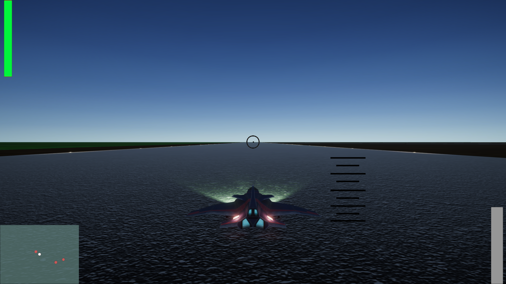
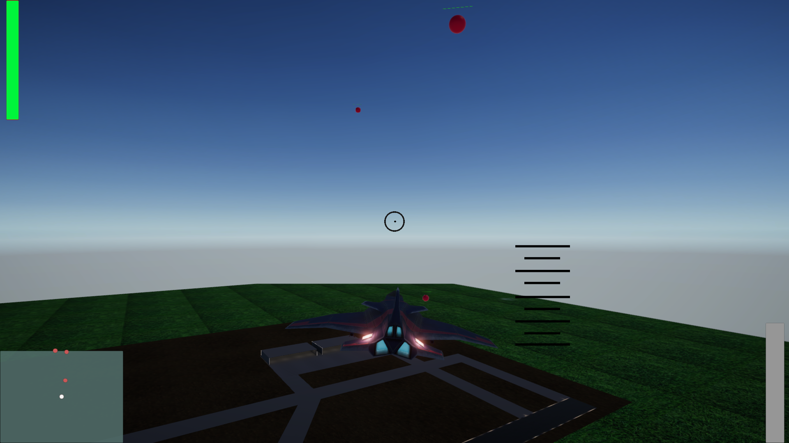
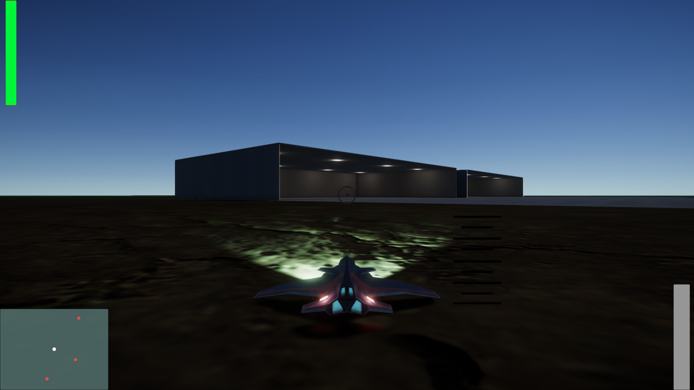
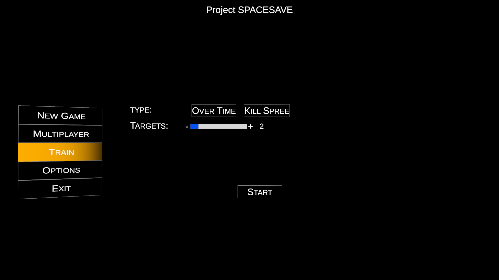

# Space-Battle
Multiplayer Jets Dog Fight.    

The player can choose between:
- Training on shooting down static (red) targets.
- Playing Multiplayer game against an enemy (which he can invite or join a random game). *still under development.

The scences were made with Terrain.  
The jet was taken from Unity assetstore.  
Added to it Scripts for:  
- Shooting
- Health
- Health bar.
- Flight Control (with physics)
- Radar/Map for Finding enemies.

Baked Lights (except for lights on the plane in the dark scenes)  
PhotonNetwork is used to make the multiplayer play: connect to rooms, match with other players, and sync across devices.  

